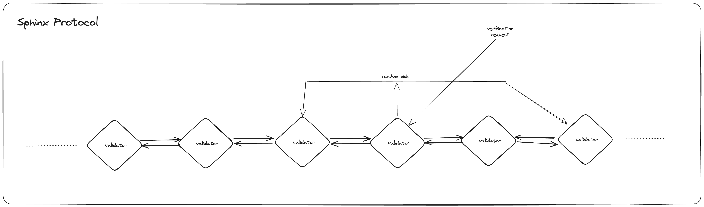
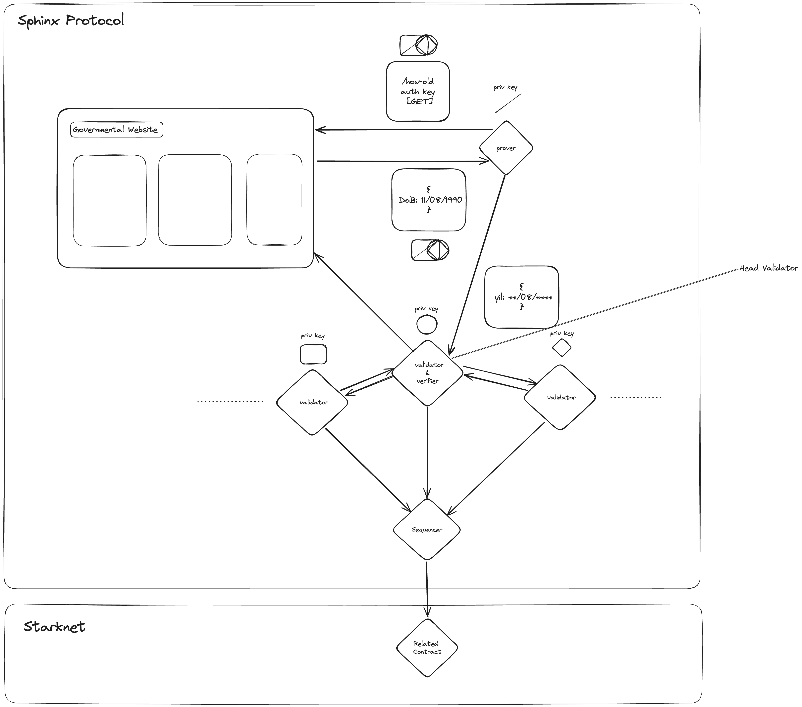
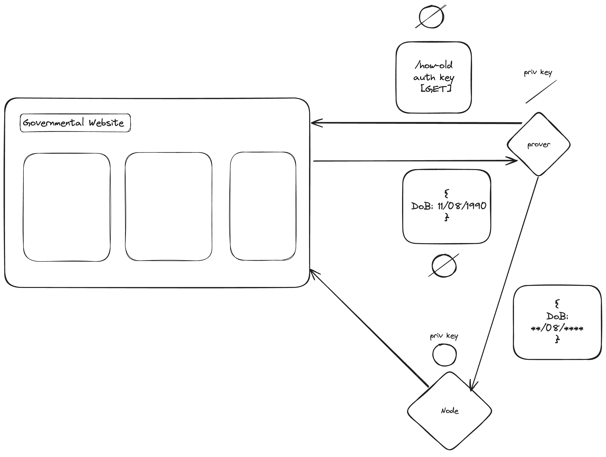
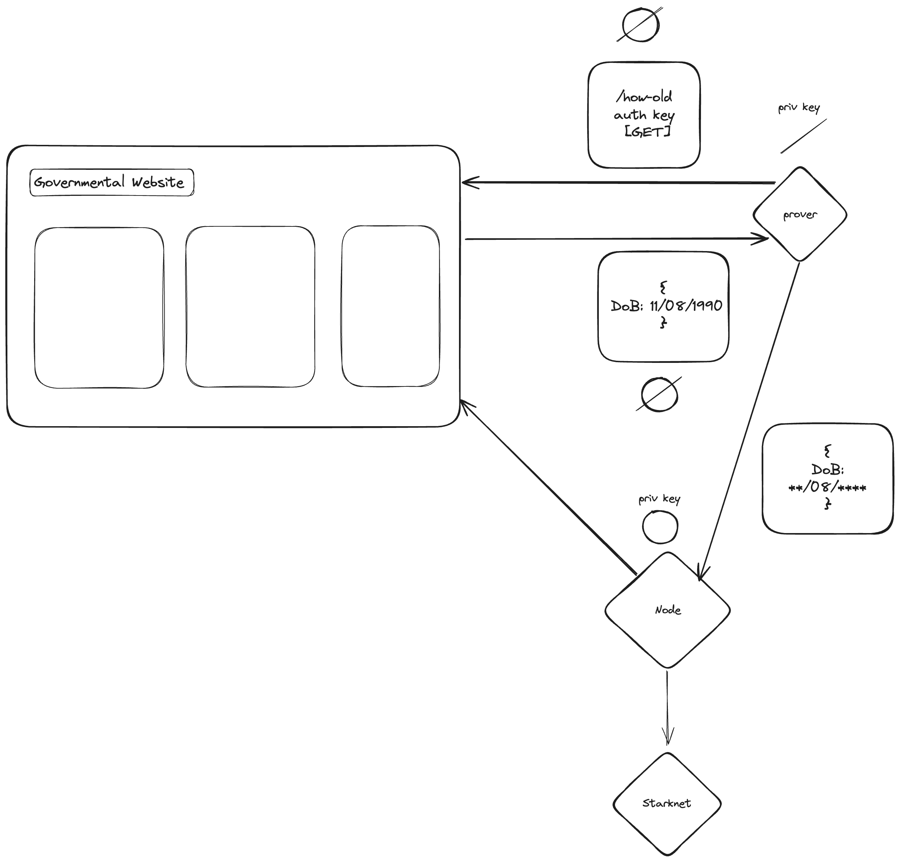
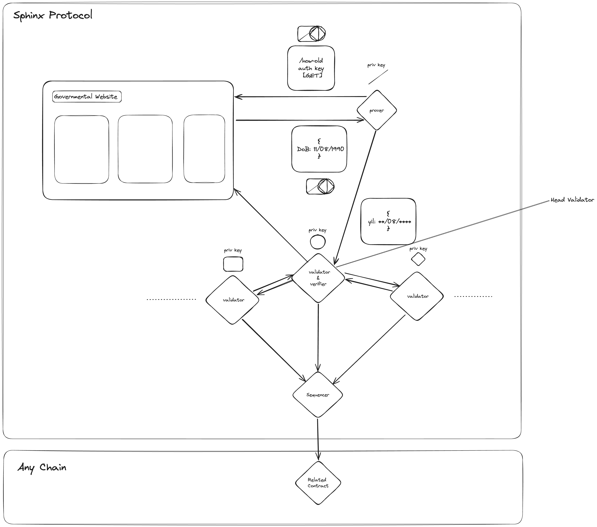

# Sphinx Protocol

Sphinx protocol is a decentralized layer 3 (on Starknet) user based privacy preserving oracle providing protocol.

# Table of Contents

[1. What is changed on Sphinx Protocol?](#1-what-is-changed-on-sphinx-protocol)
[2. General Overview of Sphinx Protocol](#2-general-overview-of-sphinx-protocol)
[3. Architecture of Sphinx Protocol](#3-architecture-of-sphinx-protocol)
[4. What is the Current Stage of Sphinx Protocol?](#4-what-is-the-current-stage-of-sphinx-protocol)
[4.1. Reports](#41-reports)
[5. Development Phases of Sphinx Protocol](#5-development-phases-of-sphinx-protocol)
[5.1. Stage 1: Implementation of tlsnotary](#51-stage-1-implementation-of-tlsnotary)
[5.2. Stage 2: Implementation of writing data to StarkNet](#52-stage-2-implementation-of-writing-data-to-starknet)
[5.3. Stage 3: Implementation of user request to the node](#53-stage-3-implementation-of-user-request-to-the-node)
[5.4. Stage 4: Implementation of the consensus protocol](#54-stage-4-implementation-of-the-consensus-protocol)
[5.5. Stage 5: Implementation of writing data to other chains](#55-stage-5-implementation-of-writing-data-to-other-chains)
[6. Conclusion](#6-conclusion)
[7. Core Team](#7-core-team)

## 1. What is changed on Sphinx Protocol?

Over the course of our research, our team identified key areas that require crucial modifications. Over the past two months, our focus has been on exploring ways to make Sphinx DB trustless or at least minimize the level of trust involved. The current method of running Cairo on a single computer and transferring it to Starknet presents reliability issues, as a database can be manipulated locally and falsely represented as verified. To address this challenge, we have opted to minimize trust to the greatest extent possible through the implementation of alternative techniques, which will serve as the overarching theme of this paper.

## 2. General overview of Sphinx Protocol

The initial phase of the Sphinx protocol involves serving as a notary for TLS requests, wherein it generates zero-knowledge proofs (zk proofs) for both the existence of data and the data itself. This process enhances the protocol's ability to ensure the integrity of information. Subsequently, this validated data can be written to Starknet, rendering it accessible and functional.

Moving into the third stage of development, users utilizing the Sphinx protocol will gain the capability to generate custom TLS requests, thereby extending the protocol's flexibility and utility. This marks a significant progression in the protocol's evolution, allowing users to tailor their interactions according to specific requirements.

As the protocol matures, the focus will shift towards transforming Sphinx into a network. This pivotal phase will witness the development of a consensus protocol, a fundamental component in establishing a robust and decentralized infrastructure. This consensus mechanism will play a crucial role in maintaining the integrity and security of the network, ensuring that all participants reach agreement on the state of the system.

In the final stage of evolution, the Sphinx protocol will undergo changes to enable seamless operation across multiple chains. This modification is aimed at enhancing interoperability and adaptability, enabling the protocol to navigate and interact within a diverse blockchain ecosystem. These comprehensive developments showcase the strategic evolution of the Sphinx protocol, from a TLS notary to a versatile and interoperable system with a robust consensus mechanism.

## 3. Architecture of Sphinx Protocol

In this section, we present an overview of the general architecture of the Sphinx protocol in its final form. However, it's important to note that the actual product launch is slated to occur after the completion of the [second stage](#52-stage-2-implementation-of-writing-data-to-starknet), which will be elaborated upon in greater detail in [Section 5](#5-development-phases-of-sphinx-protocol).

The Sphinx protocol, at its core, operates as a decentralized network, empowering users and developers to generate custom TLSNotary requests. These requests can be seamlessly transmitted to the network, allowing users to obtain proof of their response data in a permissionless and trustless manner. The protocol's initial integration is designed to work with Starknet, offering users the flexibility to retain their data within the Sphinx network or extend their reach to various other supported chains.

The unique feature of Sphinx lies in its ability to facilitate the verification process and securely anchor proofs on-chain. This ensures a robust and tamper-resistant validation mechanism. Post-verification, users gain the capability to write their data onto any supported chain within the ecosystem.

To provide a more detailed understanding, let's delve into [Section 5](#5-development-phases-of-sphinx-protocol), where we outline the various development phases of the Sphinx protocol. This structured approach encompasses the implementation of essential components, such as the introduction of custom TLSNotary requests, writing data to Starknet, handling user requests, deploying a consensus protocol, and eventually expanding data writing capabilities to other chains. The subsequent sections will provide a comprehensive breakdown of each stage, offering insights into the protocol's evolution and functionality.

Let's expand on the flow of a user's request example as it progresses through the stages within the Sphinx protocol:

In the initial phase of this user request example within the Sphinx protocol, a user submits a request to the network, aiming to demonstrate that they were born in the 8th month. To ensure decentralization and enhance security, a random selection process designates one validator or verifier as the head verifier. This head verifier, in turn, selects an additional subset of validators, denoted as x (with the specific value to be determined through benchmarking). In this illustrative example, let's consider x as 2, resulting in a total of 3 validators, including the head verifier, engaged in the verification process for the user's TLS request.

Moving to the second part of the process, the head verifier takes on the role of a TLSNotary, serving as a proxy between the user and the web server. Utilizing the multiparty handshake keys generated by the selected subset of validators and the prover, the head verifier employs TLSNotary to verify the data from the web server. This multiparty handshake ensures a secure and verifiable interaction between the user and the web server.

As the TLSNotary verification unfolds, the remaining validators within the selected subset independently verify the proof's validity and authenticate the data. Once this verification process is successfully completed, the validated data is written to the relevant chain. This includes both the internal chain of the Sphinx Protocol and potentially other external chains (Starknet will be the first chain) supported by the broader ecosystem.

This detailed walkthrough demonstrates the meticulous process through which user requests are securely handled within the Sphinx protocol. By integrating TLSNotary, leveraging multiparty handshake keys, and utilizing a collaborative network of validators, the Sphinx protocol ensures the trustless and tamper-resistant verification of user-requested data, fostering a robust and reliable environment for user interactions within the network.

## 4. What is the current stage of Sphinx Protocol?

As we approach the conclusion of the research phase, our team has delved into an extensive exploration of pertinent implementations in the realm of protocols. The culmination of our efforts has resulted in comprehensive reports that not only detail these identified protocols but also shed light on their potential applicability and inspiration for enhancing the robustness of our own Sphinx protocol.

Among the key papers scrutinized during this phase, we have meticulously analyzed their advantages and disadvantages to distill insights that can contribute to the refinement of our protocol. By drawing upon the strengths of existing technologies and acknowledging potential drawbacks, we aim to build a foundation that is not only innovative but also mindful of the challenges faced by similar systems.

This research endeavor involves a systematic review of the various facets of these protocols, including their architectures, security measures, and scalability features. The objective is to discern elements that align with our goals and can fortify the Sphinx protocol in terms of reliability and efficiency.

In summary, this research phase represents a crucial step in synthesizing knowledge from relevant papers, extracting valuable lessons, and synthesizing a well-informed approach to further develop our protocol. The amalgamation of these insights will serve as a robust foundation as we transition from the research phase into the implementation and refinement stages of the Sphinx protocol.

### 4.1. Reports

- [zkPass](https://github.com/SphinxDB/Sphinx-Exploration/blob/main/exploration/zkPass.md)
- [TLS Notary](https://github.com/SphinxDB/Sphinx-Exploration/blob/main/tools_and_infrastructure/tlsnotary.md)
- [DECO](https://github.com/SphinxDB/Sphinx-Exploration/blob/main/tools_and_infrastructure/DECO.md)

## 5. Development Phases of Sphinx Protocol

The development and evolution of the Sphinx protocol will traverse several key stages, each contributing to the enhancement and refinement of the protocol's capabilities. Below, we outline the successive stages that Sphinx will undergo, providing a comprehensive overview of the protocol's journey:

### 5.1. Stage 1: Implementation of tlsnotary

In this initial stage, the Sphinx protocol will undergo the implementation of TLSNotary. Concrete examples of requests will be formulated, and comprehensive benchmarks will be conducted to ensure optimal performance. During this stage, the protocol will operate with a single node, setting the groundwork for subsequent advancements. The visualization below illustrates the integration of TLSNotary into the Sphinx protocol.

### 5.2. Stage 2: Implementation of writing data to StarkNet

Building upon the TLSNotary implementation, Stage 2 focuses on enabling the Sphinx protocol to support a set of requests. These requests will have the capability to be written to StarkNet, marking a significant milestone for the product. The protocol will undergo a soft launch at this juncture, accompanied by the development of a user-friendly interface to enhance accessibility. Trust will be minimized using SGX in the node.

### 5.3. Stage 3: Implementation of user request to the node

Advancing to Stage 3, the Sphinx protocol expands its functionality by allowing users and developers to contribute custom TLS requests. This stage marks the public launch of the product, emphasizing user engagement. The user interface and experience (UI/UX) will be a focal point, ensuring a seamless and intuitive interaction. Drawing inspiration from DECO and zkpass, additional features will be implemented to enhance privacy and security.

### 5.4. Stage 4: Implementation of the consensus protocol

Stage 4 signifies a pivotal moment in the development of Sphinx as the consensus protocol is implemented. This introduces a decentralized decision-making mechanism, reinforcing the reliability and security of the Sphinx network.

### 5.5. Stage 5: Implementation of writing data to other chains

In the final stage of development, Sphinx expands its capabilities to write data across multiple chains, showcasing interoperability within the broader blockchain ecosystem. This phase strengthens Sphinx's position as a versatile and interconnected protocol. The visualization below illustrates the interchain operability achieved by the Sphinx protocol.

Each stage in the development roadmap of the Sphinx protocol is designed to incrementally enhance its functionality, security, and usability. The strategic progression from TLSNotary implementation to consensus protocol integration reflects a holistic approach, ensuring that Sphinx evolves into a robust and versatile decentralized network.

## 6. Conclusion

In conclusion, the development journey of the Sphinx protocol unfolds as a systematic and strategic progression through multiple stages, each contributing to the protocol's enhancement and sophistication. From the foundational implementation of TLSNotary in the initial stage to the culmination of interoperability across multiple chains in the final stage, Sphinx evolves into a decentralized network capable of meeting diverse user needs within the blockchain landscape.

The integration of TLSNotary, writing data to StarkNet, and empowering users with custom requests showcase the protocol's commitment to security, functionality, and user engagement. The implementation of a consensus protocol further solidifies Sphinx's position as a reliable and decentralized system, providing a trustless environment for users and developers.

Throughout its development, Sphinx draws inspiration from established technologies such as DECO and zkpass, integrating features that enhance privacy and security. The visualizations accompanying each stage highlight the protocol's evolution and its journey towards becoming a versatile and interconnected solution.

As Sphinx progresses through its development roadmap, the emphasis on benchmarks, soft launches, and continual improvements in UI/UX underscore a commitment to performance and user experience. The protocol's capacity to write data not only to StarkNet but also to other chains underscores its adaptability within the broader blockchain ecosystem.

In essence, the Sphinx protocol stands poised to offer a robust, trustless, and versatile solution, providing users with a decentralized platform for secure interactions and data management across various blockchain networks. Through the strategic implementation of each stage, Sphinx embodies the ethos of continuous innovation and adaptability in the dynamic landscape of decentralized technologies.

## 6. Core Team

<table>
  <tbody>
    <tr>
      <td align="center" valign="top" width="14.28%"><a href="https://github.com/karasakalmt"> <b>Mete Karasakal</b></a>
      <td align="center" valign="top" width="14.28%"><a href="https://github.com/yamancan"> <b>Yaman Can</b></a>
      <td align="center" valign="top" width="14.28%"><a href="https://github.com/izzetemredemir"> <b>İzzet Emre Demir</b></a></td>
      <td align="center" valign="top" width="14.28%"><a href="https://github.com/codekaya"> <b>Yusuf Kaya</b></a></td>
    </tr>
  </tbody>
</table>
