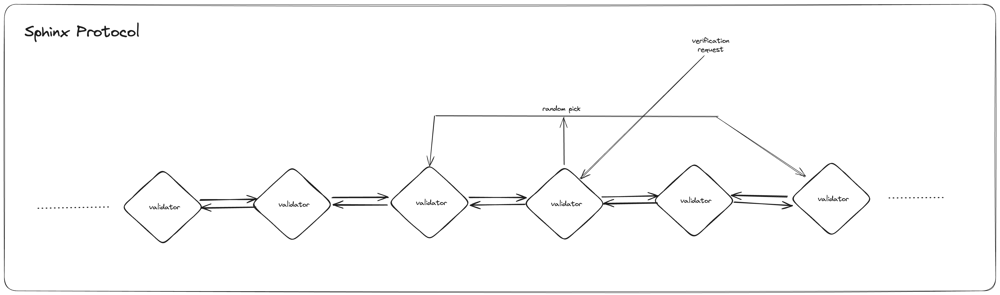
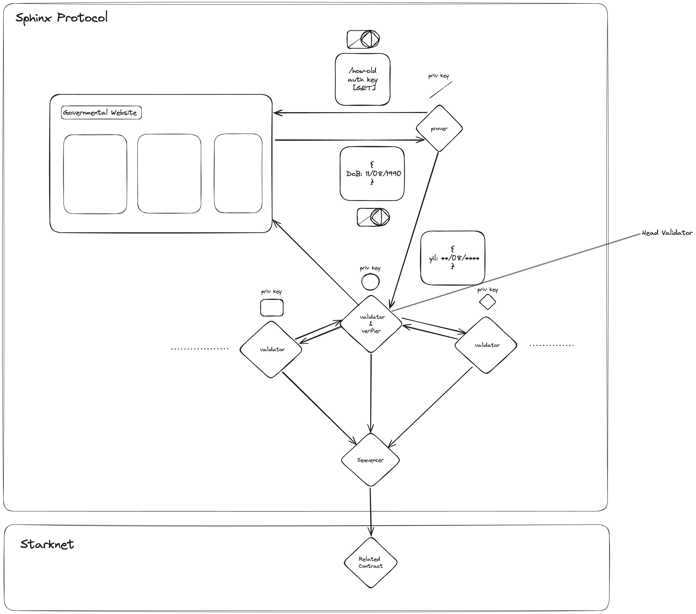
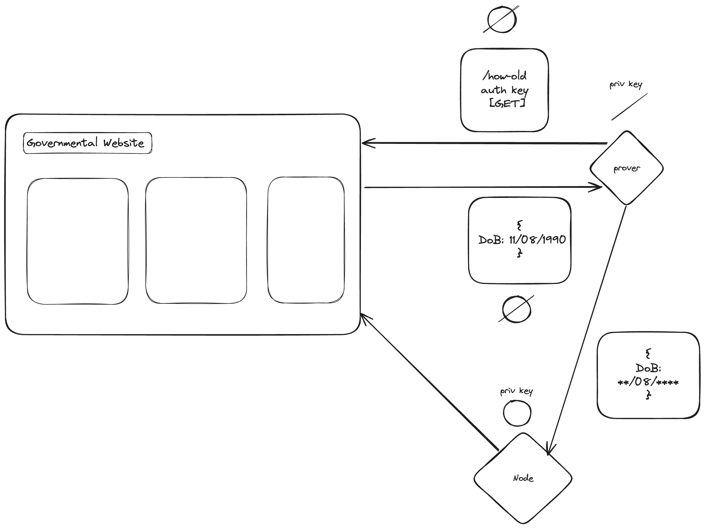
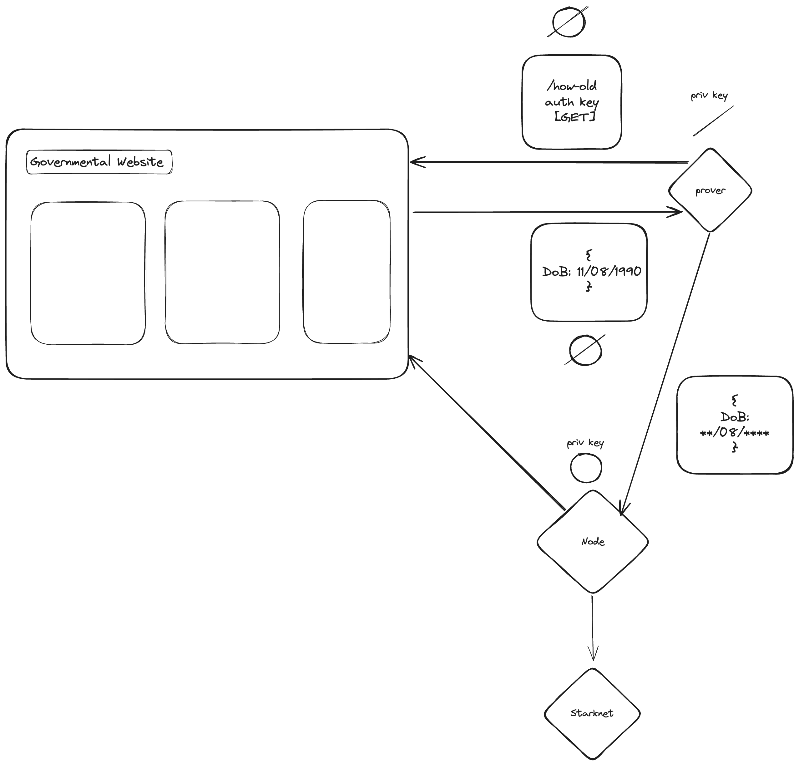
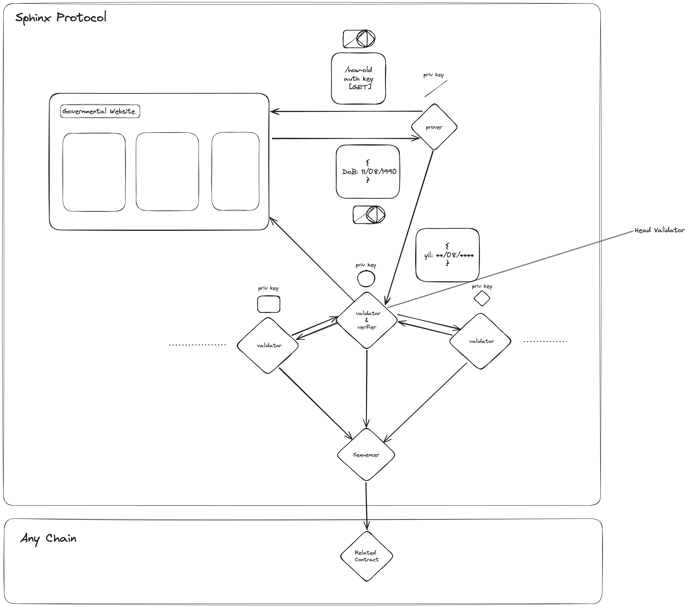

# Sphinx Protocol

Sphinx protocol is a decentralized layer 3 (of Starknet) for enabling verifiable & customizable Web2 to Web3 data providing.

# Table of Contents

[1. Introduction to Sphinx Protocol Changes](#1-introduction-to-sphinx-protocol-changes)  
[2. General Overview of Sphinx Protocol](#2-general-overview-of-sphinx-protocol)  
[3. Architecture](#3-architecture)  
[4. Synthesizing Insights for the Sphinx Protocol: A Comprehensive Review of Existing Technologies](#4-synthesizing-insights-for-the-sphinx-protocol-a-comprehensive-review-of-existing-technologies)  
[4.1. Reports](#41-reports)  
[5. Development Phases of Sphinx Protocol](#5-development-phases-of-sphinx-protocol)  
[5.1. Stage 1: Implementation of tlsnotary](#51-stage-1-implementation-of-tlsnotary)  
[5.2. Stage 2: Implementation of writing data to StarkNet](#52-stage-2-implementation-of-writing-data-to-starknet)  
[5.3. Stage 3: Implementation of user request to the node](#53-stage-3-implementation-of-user-request-to-the-node)  
[5.4. Stage 4: Implementation of the consensus protocol](#54-stage-4-implementation-of-the-consensus-protocol)  
[5.5. Stage 5: Implementation of writing data to other chains](#55-stage-5-implementation-of-writing-data-to-other-chains)  
[6. Conclusion](#6-conclusion)  
[7. Core Team](#7-core-team)

## 1. Introduction to Sphinx Protocol Changes

The primary goal of Sphinx DB has been to ensure the integrity of database queries. This focus stems from identified challenges with the current process, where running Cairo on a single computer and transferring data to Starknet might compromise data reliability. Such a method risks local manipulation of the database, presenting a false appearance of verification. To counteract these challenges, recent efforts have concentrated on developing critical solutions that either eliminate or significantly reduce reliance on external reliability assurances for SphinxDB. To minimize trust, we have adopted the idea of setting up a network where users can share the requests they want to verify to minimize trust. When setting up this network, we are implementing things like TLSnotary to ensure zero toxicity.

This initiative represents a pivotal shift in how we address the potential for data manipulation and falsification, marking a significant stride toward enhancing the protocol's security and trustworthiness.

## 2. General overview of Sphinx Protocol

The initial phase of the Sphinx Protocol involves serving as a notary for TLS requests, wherein it generates zero-knowledge proofs (zk proofs) for both the existence of data and the data itself. This process enhances the protocol's ability to ensure the integrity of information. Subsequently, this validated data can be written to Starknet, rendering it accessible and functional.

In next phases of development, users utilizing the Sphinx protocol will gain the capability to generate custom TLS requests, thereby extending the protocol's flexibility and utility. This marks a significant progression in the protocol's evolution, allowing users to tailor their interactions according to specific requirements.

As the protocol matures, the focus will shift towards transforming Sphinx into a network. This pivotal phase will witness the development of a consensus protocol, a fundamental component in establishing a robust and decentralized infrastructure. This consensus mechanism will play a crucial role in maintaining the integrity and security of the network, ensuring that all participants reach agreement on the state of the system.

In the final stage of evolution, the Sphinx protocol will undergo changes to enable seamless operation across multiple chains while being Starknet-first. This modification is aimed at enhancing interoperability and adaptability, enabling the protocol to navigate and interact within a diverse blockchain ecosystem. These comprehensive developments showcase the strategic evolution of the Sphinx protocol, from a TLS notary to a versatile and interoperable system with a robust consensus mechanism.

## 3. Architecture

In this section, we present an overview of the general architecture of the Sphinx protocol in its final form. However, it's important to note that the actual product launch is slated to occur after the completion of the [second stage](#52-stage-2-implementation-of-writing-data-to-starknet), which will be elaborated upon in greater detail in [Section 5](#5-development-phases-of-sphinx-protocol).

The Sphinx protocol, at its core, operates as a decentralized network, empowering users and developers to generate custom TLSNotary requests. These requests can be seamlessly transmitted to the network, allowing users to obtain proof of their response data in a permissionless and trustless manner. The protocol's initial integration is designed to work with Starknet, offering users the flexibility to retain their data within the Sphinx network or extend their reach to various other supported chains.

The unique feature of Sphinx lies in its ability to facilitate the verification process and securely anchor proofs on-chain. This ensures a robust and tamper-resistant validation mechanism. Post-verification, users gain the capability to write their data onto any supported chain within the ecosystem.

To provide a more detailed understanding, let's delve into [Section 5](#5-development-phases-of-sphinx-protocol), where we outline the various development phases of the Sphinx protocol. This structured approach encompasses the implementation of essential components, such as the introduction of custom TLSNotary requests, writing data to Starknet, handling user requests, deploying a consensus protocol, and eventually expanding data writing capabilities to other chains. The subsequent sections will provide a comprehensive breakdown of each stage, offering insights into the protocol's evolution and functionality.

Let's expand on the flow of a user's request example as it progresses through the stages within the Sphinx protocol:

1. User Initiates the Request. For example a user submits a request to the network, aiming to demonstrate that they were born in the 8th month.
2. To ensure decentralization and enhance security, a random selection process designates one validator or verifier as the head verifier. This head verifier, in turn, selects an additional subset of validators, denoted as x (with the specific value to be determined through benchmarking). In this illustrative example, let's consider x as 2, resulting in a total of 3 validators, including the head verifier, engaged in the verification process for the user's TLS request.

3. The head verifier takes on the role of a TLSNotary, serving as a proxy between the user and the web server. Utilizing the multiparty handshake keys generated by the selected subset of validators and the prover, the head verifier employs TLSNotary to verify the data from the web server. This multiparty handshake ensures a secure and verifiable interaction between the user and the web server.

4. As the TLSNotary verification unfolds, the remaining validators within the selected subset independently verify the proof's validity and authenticate the data. Once this verification process is successfully completed, the validated data is written to the relevant chain. This includes both the internal chain of the Sphinx Protocol and potentially other external chains (Starknet will be the first chain) supported by the broader ecosystem.

This detailed walkthrough demonstrates the meticulous process through which user requests are securely handled within the Sphinx protocol. By integrating TLSNotary, it enables multiparty handshake keys, and utilizing a collaborative network of validators, the Sphinx Protocol ensures the trustless and tamper-resistant verification of user-requested data, fostering a robust and reliable environment for user interactions within the network.

## 4. Synthesizing Insights for the Sphinx Protocol: A Comprehensive Review of Existing Technologies

As the research phase nears its end, our team has conducted a thorough investigation of relevant implementations in the field of protocols. This effort has led to the generation of detailed reports that outline the identified protocols, providing insights into their possible use and how they might inform improvements to the Sphinx protocol.

In reviewing key papers during this phase, we have carefully considered the pros and cons of each to extract valuable lessons for our protocol's development. Our goal is to leverage the benefits of existing technologies while being aware of their limitations, striving to create a protocol that is both forward-thinking and attuned to the obstacles encountered by comparable systems.

This research endeavor involves a systematic review of the various facets of these protocols, including their architectures, security measures, and scalability features. The objective is to discern elements that align with our goals and can fortify the Sphinx protocol in terms of reliability and efficiency.

In summary, this research phase represents a crucial step in synthesizing knowledge from relevant papers, extracting valuable lessons, and synthesizing a well-informed approach to further develop our protocol. The amalgamation of these insights will serve as a robust foundation as we transition from the research phase into the implementation and refinement stages of the Sphinx protocol.

### 4.1. Reports

- [zkPass](https://github.com/SphinxDB/Sphinx-Exploration/blob/main/exploration/zkPass.md)
- [TLS Notary](https://github.com/SphinxDB/Sphinx-Exploration/blob/main/tools_and_infrastructure/tlsnotary.md)
- [DECO](https://github.com/SphinxDB/Sphinx-Exploration/blob/main/tools_and_infrastructure/DECO.md)

## 5. Development Phases of Sphinx Protocol

The development and evolution of the Sphinx protocol will traverse several key stages, each contributing to the enhancement and refinement of the protocol's capabilities. Below, we outline the successive stages that Sphinx will undergo, providing a comprehensive overview of the protocol's journey:

### 5.1. Stage 1: Implementation of tlsnotary

In this initial stage, the Sphinx protocol will undergo the implementation of TLSNotary. Concrete examples of requests will be formulated, and comprehensive benchmarks will be conducted to ensure optimal performance. During this stage, the protocol will operate with a single node, setting the groundwork for subsequent advancements. The visualization below illustrates the integration of TLSNotary into the Sphinx protocol.

### 5.2. Stage 2: Implementation of writing data to StarkNet

Building upon the TLSNotary implementation, Stage 2 focuses on enabling the Sphinx protocol to support a set of requests. These requests will have the capability to be written to Starknet, marking a significant milestone for the product. The protocol will undergo a soft launch at this juncture, accompanied by the development of a user-friendly interface to enhance accessibility. Trust will be minimized using SGX in the node.

### 5.3. Stage 3: Implementation of user request to the node

Advancing to Stage 3, the Sphinx protocol expands its functionality by allowing users and developers to contribute custom TLS requests. This stage marks the public launch of the product, emphasizing user engagement. The user interface and experience (UI/UX) will be a focal point, ensuring a seamless and intuitive interaction. Drawing inspiration from DECO and zkpass, additional features will be implemented to enhance privacy and security.

### 5.4. Stage 4: Implementation of the consensus protocol

Stage 4 signifies a pivotal moment in the development of Sphinx as the consensus protocol is implemented. This introduces a decentralized decision-making mechanism, reinforcing the reliability and security of the Sphinx network.

### 5.5. Stage 5: Implementation of writing data to other chains

In the final stage of development, Sphinx expands its capabilities to write data across multiple chains, showcasing interoperability within the broader blockchain ecosystem. This phase strengthens Sphinx's position as a versatile and interconnected protocol. The visualization below illustrates the interchain operability achieved by the Sphinx protocol.

Each stage in the development roadmap of the Sphinx protocol is designed to incrementally enhance its functionality, security, and usability. The strategic progression from TLSNotary implementation to consensus protocol integration reflects a holistic approach, ensuring that Sphinx evolves into a robust and versatile decentralized network.

## 6. Conclusion

In conclusion, the development journey of the Sphinx Protocol unfolds as a systematic and strategic progression through multiple stages, each contributing to the protocol's enhancement and sophistication. From the foundational implementation of TLSNotary in the initial stage to the culmination of interoperability across multiple chains in the final stage, Sphinx evolves into a decentralized network capable of meeting diverse user needs within the blockchain landscape.

The integration of TLSNotary, writing data to Starknet, and empowering users with custom requests showcase the protocol's commitment to security, functionality, and user engagement. The implementation of a consensus protocol further solidifies Sphinx's position as a reliable and decentralized system, providing a trustless environment for users and developers.

Throughout its development, Sphinx draws inspiration from established technologies such as DECO and zkpass, integrating features that enhance privacy and security. The visualizations accompanying each stage highlight the protocol's evolution and its journey towards becoming a versatile and interconnected solution.

As Sphinx progresses through its development roadmap, the emphasis on benchmarks, soft launches, and continual improvements in UI/UX underscore a commitment to performance and user experience. The protocol's capacity to write data not only to Starknet but also to other chains underscores its adaptability within the broader blockchain ecosystem.

In essence, the Sphinx protocol stands poised to offer a robust, trustless, and versatile solution, providing users with a decentralized platform for secure interactions and data management across various blockchain networks. Through the strategic implementation of each stage, Sphinx embodies the ethos of continuous innovation and adaptability in the dynamic landscape of decentralized technologies.

## 6. Core Team

<table>
  <tbody>
    <tr>
      <td align="center" valign="top" width="14.28%"><a href="https://github.com/karasakalmt"> <b>Mete Karasakal</b></a>
      <td align="center" valign="top" width="14.28%"><a href="https://github.com/yamancan"> <b>Yaman Can</b></a>
      <td align="center" valign="top" width="14.28%"><a href="https://github.com/izzetemredemir"> <b>İzzet Emre Demir</b></a></td>
      <td align="center" valign="top" width="14.28%"><a href="https://github.com/codekaya"> <b>Yusuf Kaya</b></a></td>
    </tr>
  </tbody>
</table>
